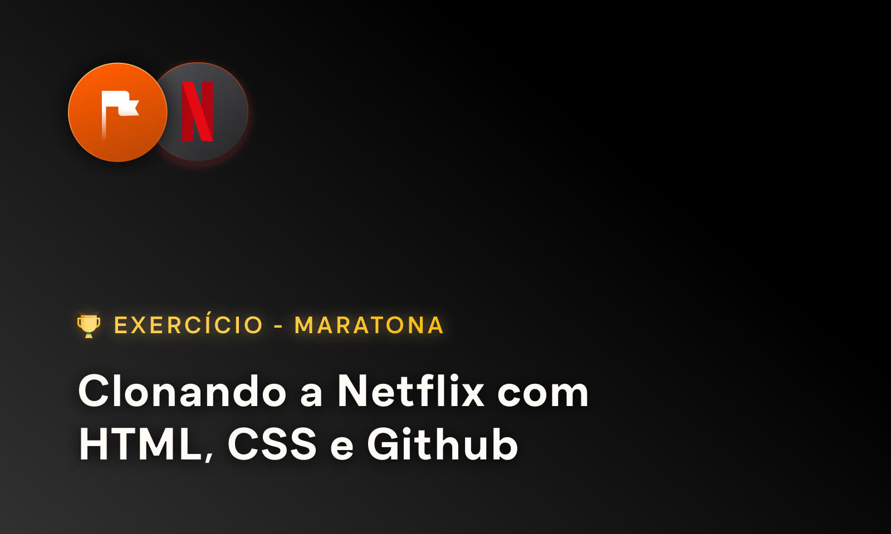

# 🏁 Desafio Prático - Componentes

  

Repósitorio criado para praticar a criação e estilização de componentes. Este código é parte do [projeto de app de música]() desenvolvido durante a maratona ["Clonando a Netflix com HTML, CSS e GitHub"](https://www.maratonas.academy/maratona-netflix) da [Maratonas Academy](https://www.maratonas.academy/).

 [Clique aqui para conferir o repositório principal da Maratona 🏁](https://github.com/guilhermeomt/clonando-a-netflix)